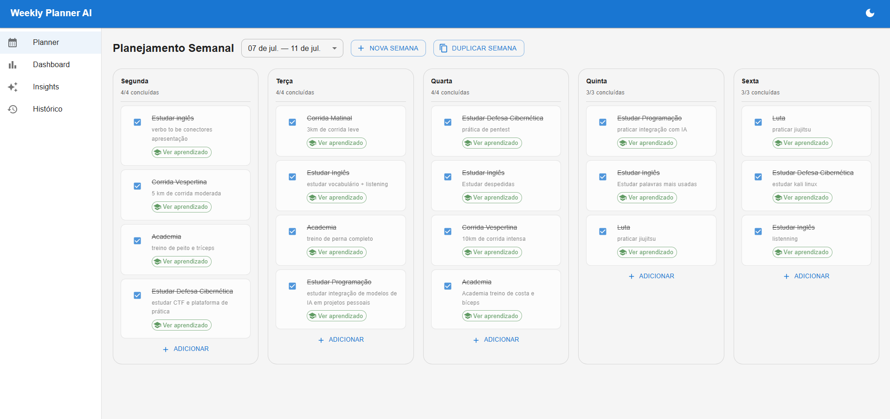
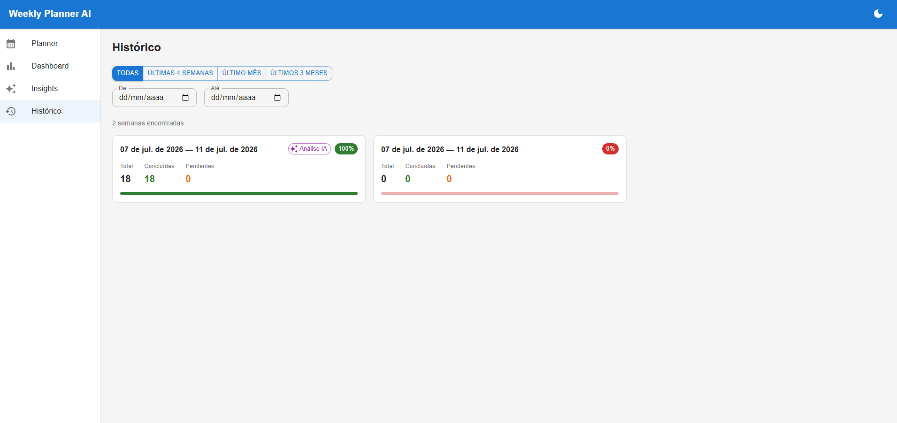

# Weekly Planner AI

> Diário de evolução pessoal assistido por IA — planeje sua semana, registre aprendizados e transforme tarefas em insights acionáveis.


## Sobre o projeto

O Weekly Planner AI não é um simples gerenciador de tarefas. É uma ferramenta de evolução pessoal que transforma o que você fez e aprendeu durante a semana em análises inteligentes geradas por IA — com pontos fortes, pontos de atenção, sugestões práticas e um mapa das habilidades que você está desenvolvendo.

## Screenshots

> *Adicione aqui prints da aplicação para dar contexto visual ao projeto.*

| Dashboard | Weekly Insights |
|---|---|
|  |  |

| Planejamento semanal | Histórico |
|---|---|
|  |  |

*(Salve as imagens em `docs/screenshots/` com esses nomes, ou ajuste os caminhos acima conforme os arquivos que você adicionar.)*

## Funcionalidades

- **Planejamento semanal** — organize tarefas de segunda a sexta com título, descrição e dia da semana
- **Execução e aprendizados** — marque tarefas como concluídas e registre o que aprendeu em cada uma
- **Dashboard** — métricas da semana com gráficos de pizza, barras por dia e linha histórica
- **Weekly Insights** — análise semanal gerada pela OpenAI com resumo, pontos fortes, sugestões e breakdown de habilidades
- **Histórico** — navegue por semanas anteriores com filtros de período e visualize tarefas e aprendizados
- **Tema claro e escuro** — alternância com persistência de preferência

## Stack

**Backend**
- Python 3.12 + FastAPI
- SQLAlchemy 2.0 + Alembic
- PostgreSQL 16
- OpenAI SDK (gpt-4o-mini)
- Pydantic v2

**Frontend**
- React 19 + TypeScript + Vite
- Material UI v5
- TanStack Query (React Query)
- Zustand
- React Hook Form
- Recharts

**Infraestrutura**
- Docker + Docker Compose
- 3 containers: backend, frontend, db

## Como rodar localmente

Este projeto roda inteiramente em containers Docker, então você **não precisa instalar Python, Node ou PostgreSQL na sua máquina** — só precisa do Docker. Você também vai precisar de um editor de código (como o [VS Code](https://code.visualstudio.com/)) apenas para abrir a pasta do projeto e editar o arquivo `.env` com suas credenciais antes de subir os containers.

### Pré-requisitos

1. **[Docker Desktop](https://www.docker.com/products/docker-desktop/)** instalado e em execução (já inclui o Docker Compose).
2. **Um editor de código**, como o [VS Code](https://code.visualstudio.com/) — usado só para editar o arquivo `.env`.
3. **Git** instalado, para clonar o repositório (ou você pode baixar o `.zip` do projeto direto do GitHub).
4. **Uma chave de API da OpenAI** ([platform.openai.com](https://platform.openai.com/api-keys)) — necessária apenas para a funcionalidade de Weekly Insights.

### Passo a passo

**1. Clone o repositório**

Abra um terminal e rode:

```bash
git clone https://github.com/SEU_USUARIO/weekly-planner.git
cd weekly-planner
```

**2. Abra a pasta no seu editor de código**

```bash
code .
```

(Isso abre a pasta do projeto no VS Code. Se preferir, pode abrir manualmente pelo editor de sua escolha.)

**3. Configure as variáveis de ambiente**

No terminal, copie o arquivo de exemplo:

```bash
cp .env.example .env
```

Agora, no editor de código, abra o arquivo `.env` que acabou de ser criado na raiz do projeto e preencha os campos com suas credenciais:

```env
# Banco de dados
POSTGRES_USER=planner
POSTGRES_PASSWORD=planner123
POSTGRES_DB=weekly_planner
DATABASE_URL=postgresql://planner:planner123@db:5432/weekly_planner

# Segurança
SECRET_KEY=troque-por-uma-chave-segura

# OpenAI (obrigatório para os Insights)
OPENAI_API_KEY=sk-...sua-chave-aqui...
```

> Você pode manter os valores padrão de banco de dados para uso local — só é essencial trocar o `SECRET_KEY` e preencher o `OPENAI_API_KEY`.

Salve o arquivo.

**4. Suba os containers**

De volta ao terminal, na raiz do projeto, rode:

```bash
docker compose up --build
```

Esse comando vai baixar as imagens necessárias, construir o backend e o frontend, e subir os 3 containers (backend, frontend e banco de dados). A primeira execução pode levar alguns minutos.

**5. Aplique as migrations do banco**

Com os containers já rodando, abra um **novo terminal** (deixe o anterior rodando) e execute:

```bash
docker compose exec backend alembic upgrade head
```

Isso cria as tabelas no banco de dados.

**6. Acesse a aplicação**

| Serviço | URL |
|---|---|
| Frontend | http://localhost:5173 |
| API (Swagger) | http://localhost:8000/docs |
| API (health) | http://localhost:8000/api/v1/health |

Pronto! A aplicação já deve estar rodando localmente. Para parar os containers, volte ao terminal onde rodou `docker compose up` e pressione `Ctrl + C`, ou rode `docker compose down` em outro terminal.

## Estrutura do projeto

```
weekly-planner/
├── docker-compose.yml
├── .env
├── backend/
│   ├── Dockerfile
│   ├── requirements.txt
│   ├── alembic.ini
│   ├── alembic/
│   └── app/
│       ├── main.py
│       ├── core/          # config e database
│       ├── models/        # SQLAlchemy models
│       ├── schemas/       # Pydantic schemas
│       ├── repositories/  # acesso ao banco
│       ├── services/      # regras de negócio
│       ├── api/           # endpoints FastAPI
│       └── integrations/
│           └── openai/    # integração com IA
└── frontend/
    ├── Dockerfile
    └── src/
        ├── pages/         # telas da aplicação
        ├── components/    # componentes reutilizáveis
        ├── hooks/         # React Query hooks
        ├── services/      # chamadas à API
        ├── store/         # Zustand stores
        └── types/         # TypeScript types
```

## Endpoints principais

### Semanas

| Método | Endpoint | Descrição |
|---|---|---|
| GET | `/api/v1/weeks/` | Lista todas as semanas |
| POST | `/api/v1/weeks/` | Cria nova semana |
| GET | `/api/v1/weeks/{id}` | Detalhe de uma semana |
| DELETE | `/api/v1/weeks/{id}` | Remove uma semana |
| POST | `/api/v1/weeks/{id}/duplicate` | Duplica semana para a próxima |

### Tarefas

| Método | Endpoint | Descrição |
|---|---|---|
| POST | `/api/v1/weeks/{id}/tasks/` | Cria tarefa |
| PATCH | `/api/v1/weeks/{id}/tasks/{tid}` | Edita tarefa |
| POST | `/api/v1/weeks/{id}/tasks/{tid}/complete` | Conclui com aprendizado |
| POST | `/api/v1/weeks/{id}/tasks/{tid}/uncomplete` | Desfaz conclusão |
| POST | `/api/v1/weeks/{id}/tasks/{tid}/duplicate` | Duplica tarefa |
| DELETE | `/api/v1/weeks/{id}/tasks/{tid}` | Remove tarefa |

### Dashboard, Insights e Histórico

| Método | Endpoint | Descrição |
|---|---|---|
| GET | `/api/v1/dashboard/{week_id}` | Métricas da semana |
| POST | `/api/v1/weeks/{id}/analysis/generate` | Gera análise com IA |
| GET | `/api/v1/weeks/{id}/analysis` | Busca análise gerada |
| GET | `/api/v1/history/` | Histórico com filtros |

A documentação completa e interativa está disponível em `/docs` (Swagger UI).

## Variáveis de ambiente

| Variável | Descrição | Obrigatória |
|---|---|---|
| `POSTGRES_USER` | Usuário do PostgreSQL | Sim |
| `POSTGRES_PASSWORD` | Senha do PostgreSQL | Sim |
| `POSTGRES_DB` | Nome do banco | Sim |
| `DATABASE_URL` | URL de conexão completa | Sim |
| `SECRET_KEY` | Chave secreta da aplicação | Sim |
| `OPENAI_API_KEY` | Chave da API da OpenAI | Para Insights |

## Modelo de dados

```
Week
├── id
├── start_date
├── end_date
└── tasks[]
    ├── id
    ├── day_of_week (monday–friday)
    ├── title
    ├── description
    ├── is_completed
    ├── completed_at
    └── learning_notes

WeeklyAnalysis
├── id
├── week_id
├── summary
├── strengths[]
├── weaknesses[]
├── suggestions[]
├── skills_breakdown{}
├── next_steps[]
└── generated_at
```

## Licença

MIT — sinta-se livre para usar, modificar e distribuir.
